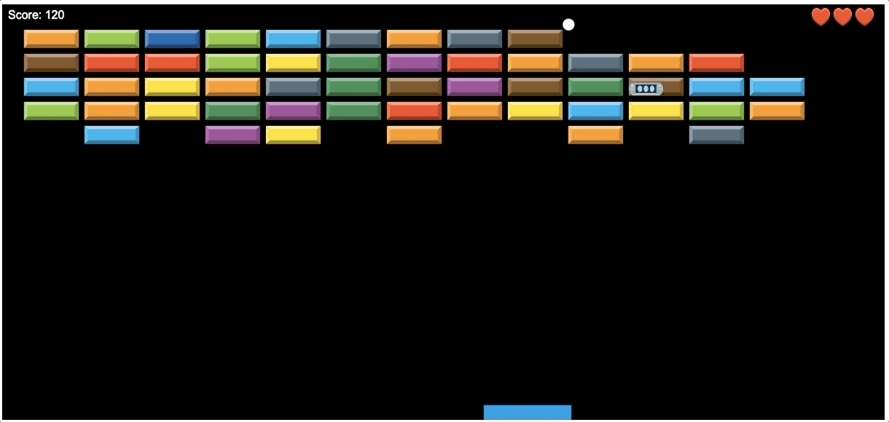

# BreakOut-Game
A version of the classic Breakout game written in javascript, HTML5 and CSS3.

This project is a part of the Ironhack Web Development course and uses many tools including using javascript to draw and animate the game in a canvas HTML element, using the Web Audio API to play sound effects and also altering the index.html page using javascript DOM manipulation.

